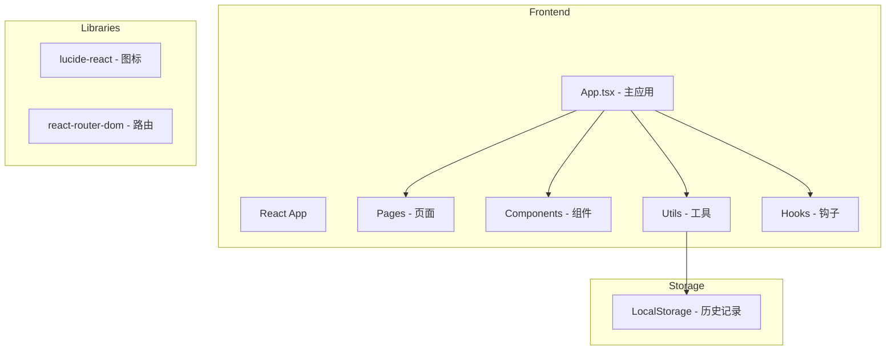
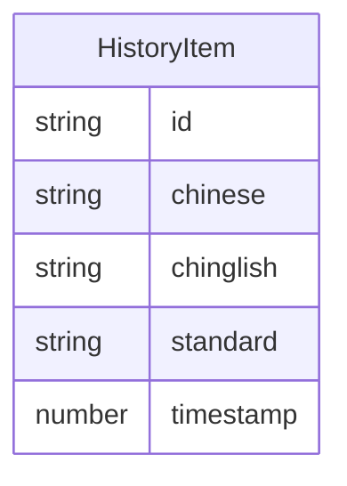

## 1. Architecture Design

## 2. Technology Description
- Frontend: React@18 + tailwindcss@3 + vite
- Initialization Tool: vite-init
- Backend: None
- Database: LocalStorage (历史记录存储)
- UI Components: 自定义组件 + lucide-react

## 3. Route Definitions
| Route | Purpose |
|-------|---------|
| / | 翻译页面，输入中文生成翻译 |
| /history | 历史记录页面，查看翻译历史 |
| /examples | 示例页面，学习翻译示例 |

## 4. API Definitions (if backend exists)
无后端API

## 5. Server Architecture Diagram (if backend exists)
无后端

## 6. Data Model (if applicable)
### 6.1 Data Model Definition

### 6.2 Data Definition Language
无数据库DDL，使用 LocalStorage 存储
