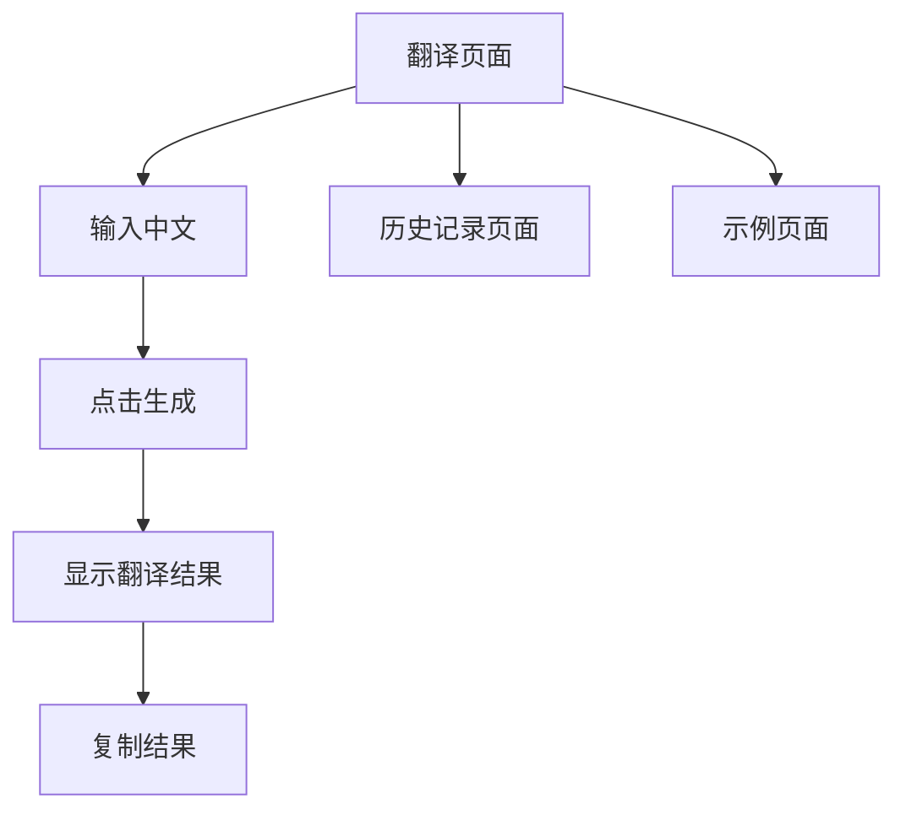

## 1. Product Overview
中式英语生成器是一个趣味学习工具，通过直观的 app 式界面帮助用户识别和学习中式英语。
- 主要功能包括中文转中式英语翻译、历史记录查看和示例学习
- 目标用户是英语学习者，特别是希望识别和避免中式英语的用户

## 2. Core Features

### 2.1 User Roles (if applicable)
无角色区分，所有用户使用相同功能

### 2.2 Feature Module
1. **翻译页面**: 输入中文文本，生成中式英语和标准英语
2. **历史记录页面**: 查看历史翻译记录，支持删除和清空
3. **示例页面**: 浏览预设翻译示例，学习典型中式英语表达

### 2.3 Page Details
| Page Name | Module Name | Feature description |
|-----------|-------------|---------------------|
| 翻译页面 | 输入区域 | 文本输入框，支持输入中文，生成按钮 |
| 翻译页面 | 结果展示 | 显示中式英语和标准英语，支持复制 |
| 历史记录页面 | 历史列表 | 展示翻译历史记录，带时间戳 |
| 历史记录页面 | 历史操作 | 支持删除单条记录和清空全部记录 |
| 示例页面 | 示例列表 | 展示预设翻译示例，支持查看详情 |

## 3. Core Process
用户在翻译页面输入中文 → 点击生成按钮 → 系统显示中式英语和标准英语 → 用户可以查看历史记录或学习示例

## 4. User Interface Design
### 4.1 Design Style
- 主色调：深蓝色（#1e40af）配合白色背景
- 按钮样式：圆角矩形，有轻微阴影和悬停效果
- 字体：使用系统默认字体，标题加粗
- 布局风格：卡片式设计，底部导航栏
- 图标风格：简洁的线性图标（使用 lucide-react）

### 4.2 Page Design Overview
| Page Name | Module Name | UI Elements |
|-----------|-------------|-------------|
| 翻译页面 | 输入区域 | 大号输入框，清晰的生成按钮，简洁的卡片布局 |
| 翻译页面 | 结果展示 | 对比式布局，左右或上下展示两种翻译结果 |
| 历史记录页面 | 历史列表 | 卡片式列表项，滑动删除动画 |
| 示例页面 | 示例列表 | 折叠卡片，展开显示详细信息 |

### 4.3 Responsiveness
- 移动优先设计，适配手机屏幕
- 底部导航栏在所有设备上固定
- 触摸交互优化，按钮尺寸适合手指点击

### 4.4 3D Scene Guidance (if applicable)
无3D场景
